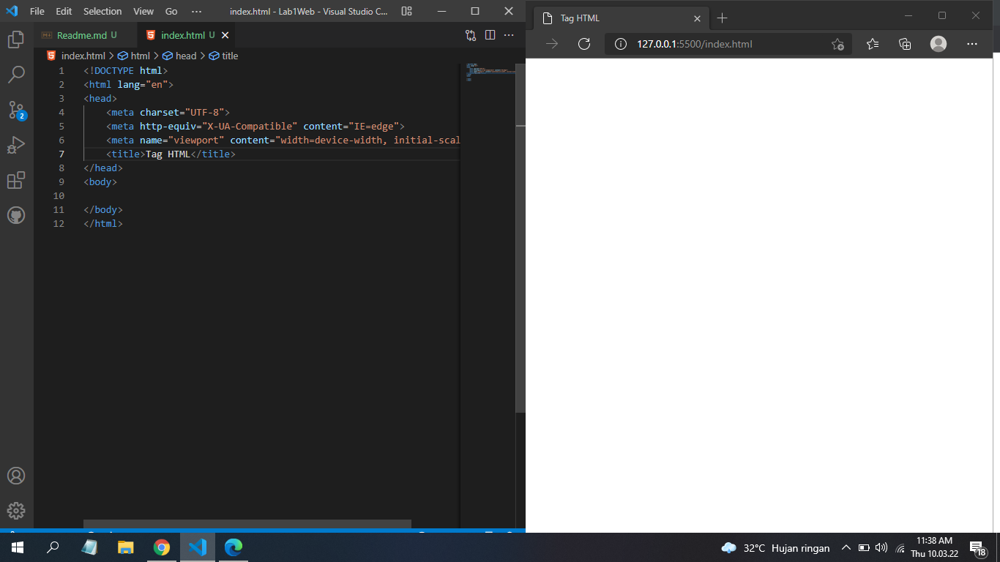
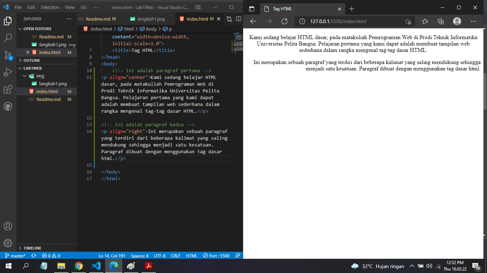
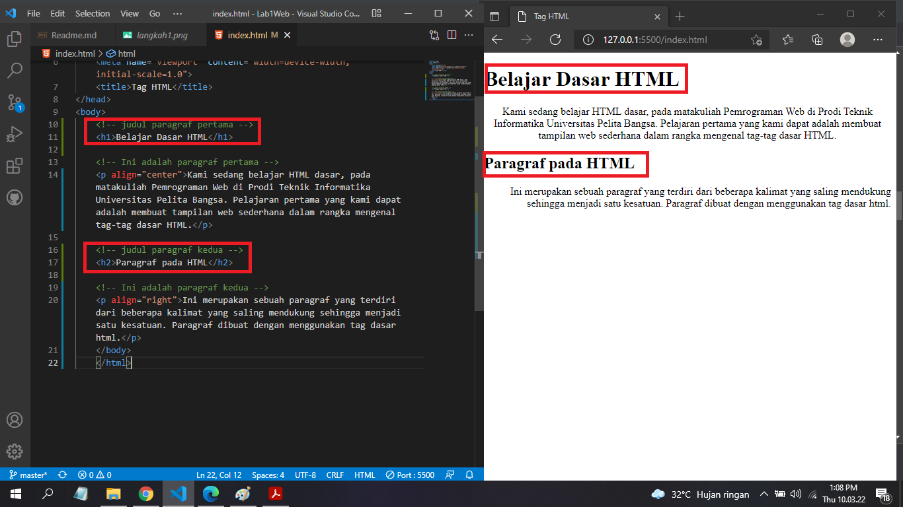
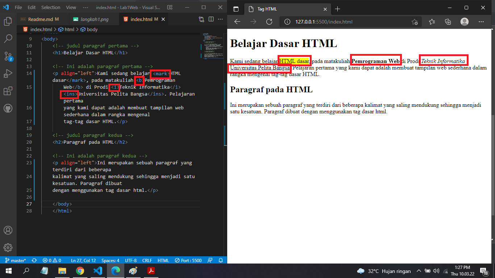

# Tugas LAB 1 Web
## Profil
| # | Biodata |
| -------- | --- |
| **Nama** | Rangga Saputra |
| **NIM** | 312010266 |
| **Kelas** | TI.20.A.2 |
| **Mata Kuliah** | Pemrograman Web |

## LANGKAH 1
* Buka VS Code dan buat file HTML baru. Setelah itu buat struktur dasar HTML
```

<!DOCTYPE html>
<html lang="en">
<head>
    <meta charset="UTF-8">
    <meta http-equiv="X-UA-Compatible" content="IE=edge">
    <meta name="viewport" content="width=device-width, initial-scale=1.0">
    <title>Tag HTML</title>
</head>
<body>
    
</body>
</html>

```
* Maka hasilnya akan seperti berikut.


## LANGKAH 2
* Membuat 2 buah paragraf dan atur atribut paragraf (Rata Kiri / Rata Kanan / Rata Tengah / Sama Rata)
```html
<!-- Ini adalah paragraf pertama -->
<p align="center">Kami sedang belajar HTML dasar, pada matakuliah Pemrograman Web di Prodi Teknik Informatika Universitas Pelita Bangsa. Pelajaran pertama yang kami dapat adalah membuat tampilan web sederhana dalam rangka mengenal tag-tag dasar HTML.</p>

<!-- Ini adalah paragraf kedua -->
<p align="right">Ini merupakan sebuah paragraf yang terdiri dari beberapa kalimat yang saling mendukung sehingga menjadi satu kesatuan. Paragraf dibuat dengan menggunakan tag dasar html.</p>
```

* Maka hasilnya akan seperti berikut.


## Langkah 3
* Menambahkan judul menggunakan Tag Heading
```html
<!-- judul paragraf pertama -->
<h1>Belajar Dasar HTML</h1>

<!-- judul paragraf kedua -->
<h2>Paragraf pada HTML</h2>
```

* Maka hasilnya akan seperti berikut.


## Langkah 4
* Memformat Teks

| Tag | Fungsi |
| -------- | --- |
| `<span style="background-color: yellow;>` | Menyisipkan sesuatu yang khusus, lalu atribut style menambahkan style pada sesuatu tersebut. |
| `<b>` | Membuat teks **bold** |
| `<i>` | Membuat teks _italic_ |
| `<u>` | Membuat teks underline |

* Maka hasilnya akan seperti berikut.


## Langkah 5
* Menyisipkan Gambar
```html
<!-- sub judul paragraf -->
<h3>Menambahkan Gambar</h3>

<!-- menambahkan gambar pada dokumen -->

```
* Maka hasilnya akan seperti berikut.
